## Summary of lidar metrics

### Height percentiles - `metrics_percentiles()`

#### Definition

Height value below which a certain percentage of lidar returns fall

Example: `zq95` (95th percentile height)

-   Sort all height values from lowest to highest, then find the height at the 95th position

-   95% of lidar returns are below this height

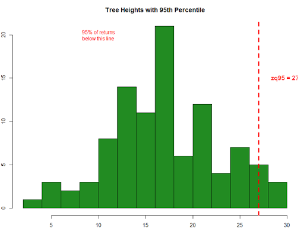

#### Link to forest structure

-   Shows dominant tree height

-   Correlates with field-measured heights

-   Downfall: ignores horizontal variation

### 2. Proportion of returns above threshold height - `metrics_percabove()`

#### Definition

Percentage of points above specified threshold heights (2m, 5m) and mean height

-   `pzabovemean` - % returns above mean elevation

-   `pzabove*` (2, 5) - % returns above (2, 5m)

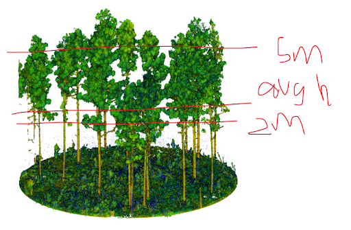

#### Link to forest structure

Characterizing the overstory, tree height distribution

### 3. Vertical structure - `metrics_dispersion()`

#### Definition

An example is Vertical Complexity Index, representing averaged structural diversity across different heights. `VCI(z, zmax)` is estimated by splitting lidar output into vertical slices and calculating the density of lidar returns across the total height.

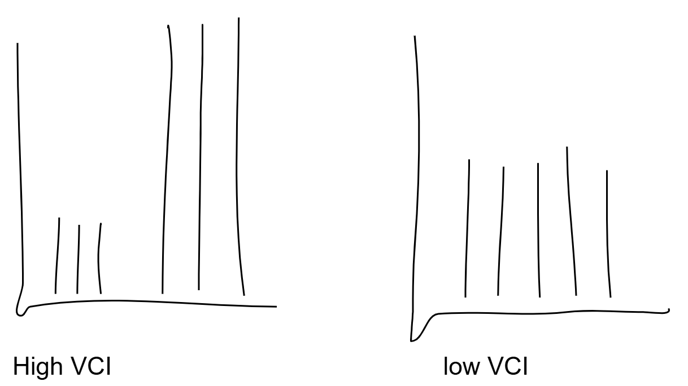

#### Link to forest structure

VCI is higher when there is more structural complexity, hence can be used as a proxy for species diversity (with limitations). It relates to Shannon Diversity Index:

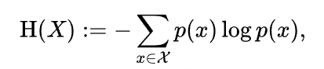

### 4. Interval metrics - `metrics_interval()`

#### Definition

This family of functions calculates the percentage of points (returns) by horizontal layers specified with elevation intervals.

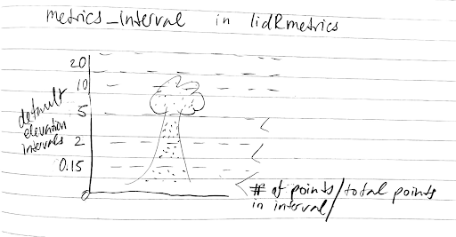

#### Link to forest structure

Could be useful for calculating understory density and maybe describe forest stratification

Drawbacks for different types of lidar:

-   Aerial: 

    -   The understory may be a blind spot for aerial lidar if there is a dense overstory. So it may misrepresent or underestimate understory density.

    -   With aerial lidar having overlapping passes over the landscape, it may show more point density over some areas.

-   Terrestrial: 

    -   Scanner settings and the quality of each scan may influence percentage of points within each horizontal layers (i.e. point “noise” if it’s windy, having sufficient \# of scan positions, laser distance for a particular scanner model) 

    -   There can be blind spots in the canopy if the stand is very densely packed or if there is a dense understory that creates lots of shadows.

### 5. L-moments metrics - `metrics_Lmoments()`

#### Definition

Statistics that describe the shape of a distribution; based on linear combinations of ranked data 

-   `L1` - mean; average of all returns

    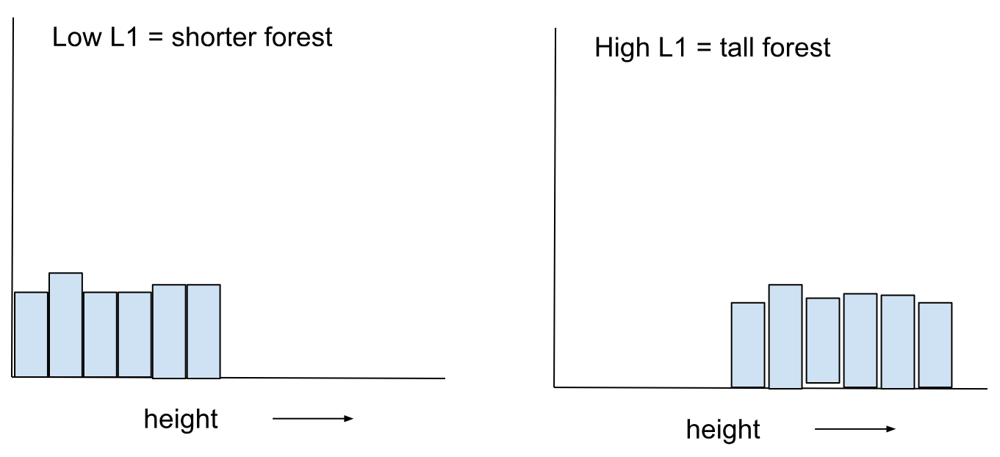

-   `Lkurt` - how peaked or flat the distribution is 

    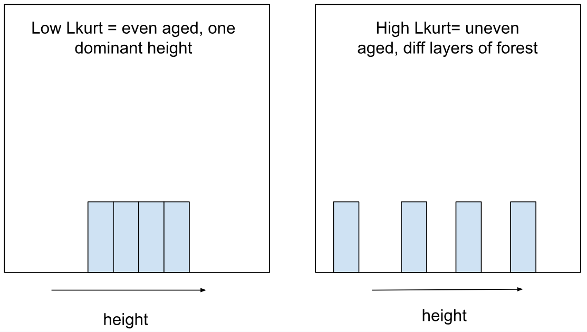

-   `Lskew` - how tailed the returns are: are they concentrated low or high?

    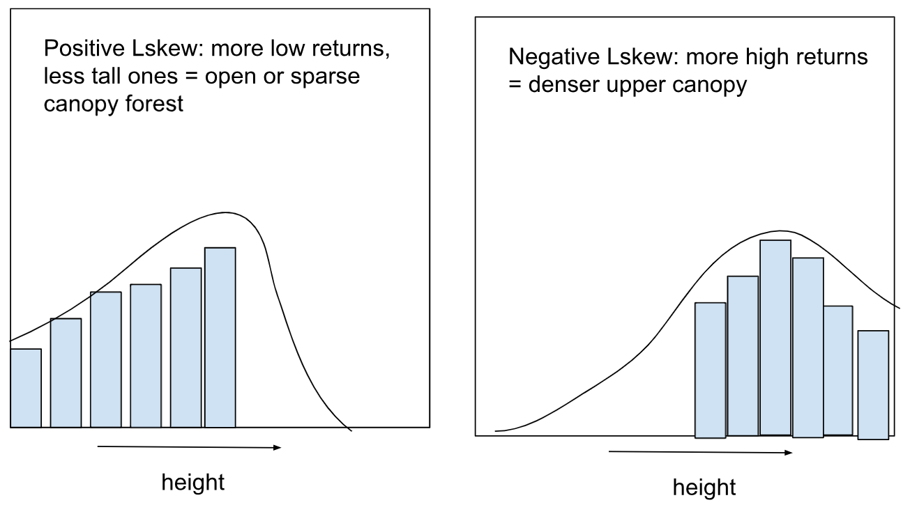

#### Link to forest structure

L-moments can be used to translate height distributions into measures of canopy height, forest structure, and vertical variation.

-   Low `L1` \~ shorter trees, younger stand; high `L1` \~ taller trees, more mature forest 

-   `Lskew`: positive \~ many low returns, open or sparse canopy; negative \~ more high returns, dense or closed canopy 

-   `Lkurt`: high \~ more uniform crown heights and dominant canopy layer; low \~ more diffuse forest structure with multiple canopy layers

### 6. Metrics calculated using voxels - `metrics_voxels()`

#### Definition

Metrics calculated in a voxel space

-   `vn` - total number of voxels

-   `vFRall`, `vFRcanopy` - filled ratio (filled voxels : all voxels)

-   `vzrumple` \~ canopy roughness (outer canopy surface area : ground surface area)

-   `vzsd`, `vzcv` - voxel elevation standard deviation, coefficient of variation

Visual from [Ross et al. (2022)](https://doi.org/10.3390/rs14051054): lidar voxel size optimization for canopy gap estimation

-   **Figure 4** shows how ALS voxels are concentrated in the upper height classes as data is collected from above, whereas TLS voxel distribution has another peak in the lower height classes representing the understory

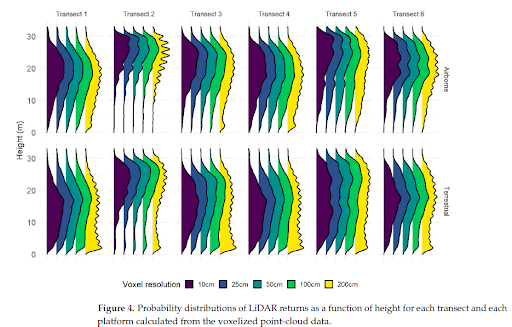

-   **Figure 5** shows how, for ALS data, more voxels get pulled from the overstory into the understory as the voxel size gets bigger and, for TLS data, voxels get pulled from the midstory into either the overstory and the understory

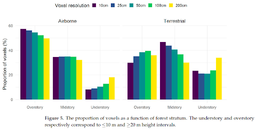

#### Link to forest structure

Better at identifying gaps

Downfall: wrong voxel resolution

### 7. Metrics based on kernel density estimation - `metrics_kde()`

#### Definition

This family of functions estimates kernel density of a Gaussian (normal) curves from data, e.g., Z or heights.

-   `kde_peaks_count` estimates number of peaks

-   `kde_peak1_elev` - elevation (Z) at which peak 1 occurs, repeats for multiple peaks

-   `kde_peak1_dens` - density “height” of peak 1, repeats for multiple peaks

-   `kde_peak1_diff` - distance between peaks (1-2), repeats for multiple peaks

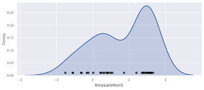

#### Link to forest structure

-   Useful for identifying height of multiple layers of forest

-   Simultaneously identify number of strata and their height

-   Identify spacing between layers (maybe identifying variation between canopy and sub canopy)

### 8. GLCM (Grey-Level Co-Occurence Matrix) metrics of a canopy height model (CHM) - `metrics_texture()`

#### Definition

-   Characterizes image texture by counting how often pixels with a certain intensity value occur in a specific spatial relationship to pixels with other intensity values

-   Can be used for individual trees using a single-band image or a segment raster

-   Metrics can hence be used as predictors for tree classification

Methods figure from [Liu et al. (2003)](https://www.frontiersin.org/journals/plant-science/articles/10.3389/fpls.2023.1284235/full). UAV imagery was used to evaluate performance of different texture features derived from different GLCM parameters (window size (see pixels), and directions (see D1-4)), to estimate aboveground biomass over crops. PC1 and PC2 are component images after Principal Component Analysis (PCA). GLCM-based texture features were calculated from PC images to assess best GLCM parameters for measuring AGB.

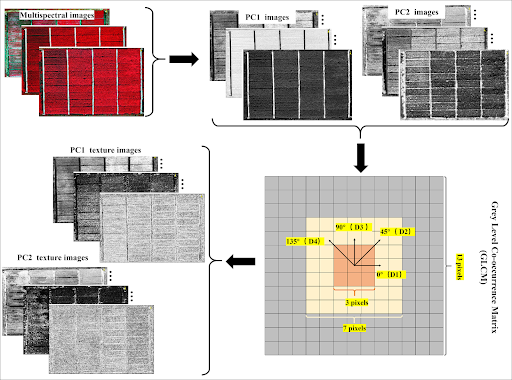

#### Link to forest structure

-   For an image of an individual tree, could it ID the species based on a bark image?

-   Could maybe be used for quantifying or capturing traits on tree boles

-   If used on a landscape scale raster image, this analysis could maybe calculate canopy openness within a stand, identify live/dead trees (depending on pixel resolution) with live/dead trees having different intensities
